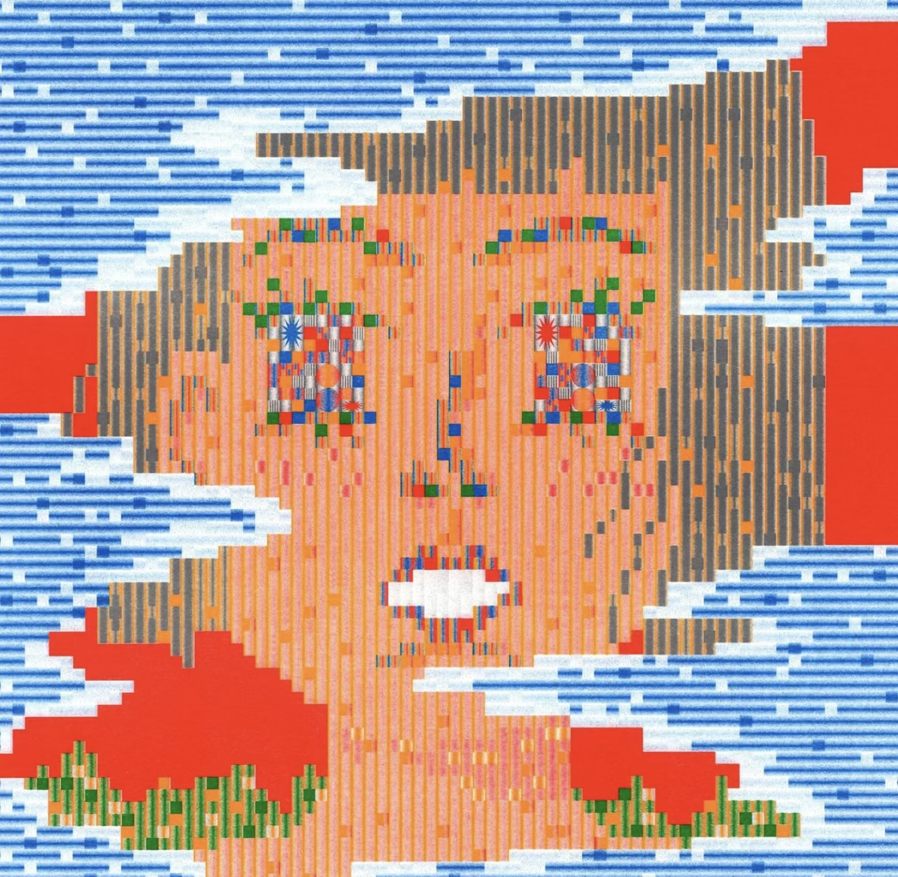
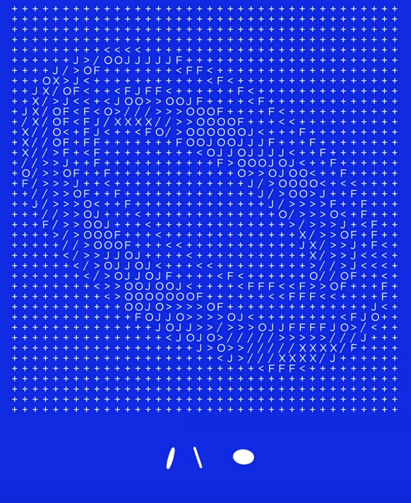

# zwan0206_9103_tut10
# Project Overview: ASCII Art Implementation

## Introduction
This project draws inspiration from Pacita Abad's 'Wheel of Fortune' and integrates the concept of ASCII art. ASCII art utilizes graphics, characters, numbers, or letters to form complex images. Our approach simplifies the replication of intricate artworks like 'Wheel of Fortune', using different ASCII characters to represent various lines and shapes. The characters' arrangement and spacing are carefully adjusted to reflect the layers and structure of the original artwork.

## Enhancing ASCII Art
While ASCII art forms the foundation, the project transcends traditional boundaries by incorporating colors and other dynamic elements. These additions aim to inspire creativity and generate visually stimulating, colorful patterns that captivate the viewer.

## Technical Implementation
Utilizing Python's Pillow library, the project involves several key steps:
- **Image Processing**: Loading and resizing the original image, followed by conversion into grayscale.
- **ASCII Conversion**: Using a diverse set of ASCII characters based on grayscale values to recreate the artistic details.
- **Customization**: The art's appearance is fine-tuned through flexible character set selections and contrast adjustments, closely mirroring the original image.
- **Optimization**: Options like character density, brightness, and contrast are adjustable, enhancing the expressiveness and richness of the ASCII art.

## Example Implementation
Below is a link to images demonstrating the coding techniques used in the project along with examples of the ASCII art created:
[ASCII Art Project Examples](https://github.com/jontonsoup4/ascii_art?tab=readme-ov-file)

